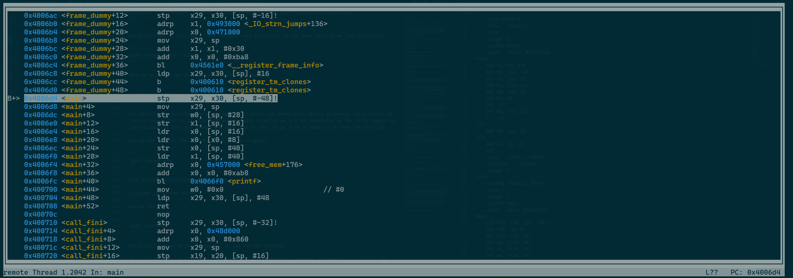
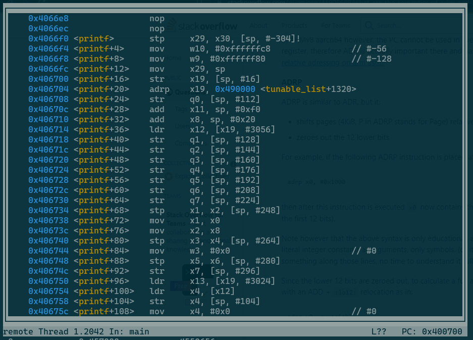
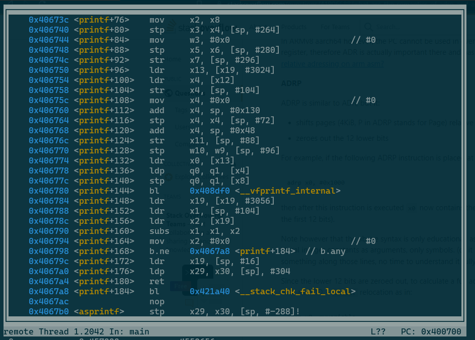
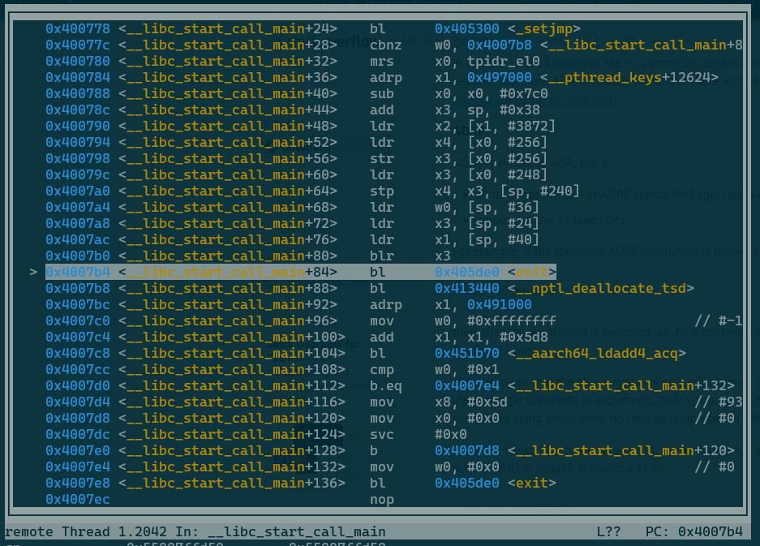
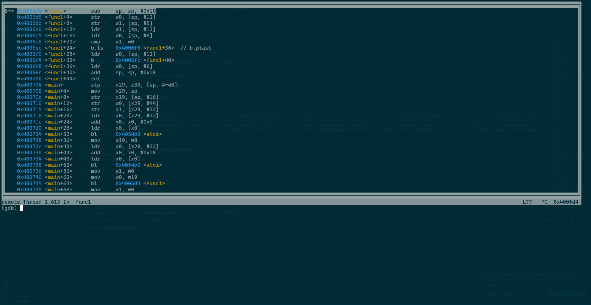

# ARMssembly_0

## The challenge
We get a file called `chall.S` which is an ARMv8 Assembly program.

The solution to the puzzle is the number this program returns with arguments 266134863 and 1592237099? 

The flag will contain this number in format: picoCTF{XXXXXXXX} -> (hex, lowercase, no 0x, and 32 bits. ex. 5614267 would be picoCTF{0055aabb})

## Cross-Compiling ARMv8 assembly on an x86_64 machine

The first intuition would be to just compile and run the program with the required inputs. This is however not a trivial task. As it is ARMv8 assembly it won't run on most normal laptop or desktop machines as they are typically x86 processor architectures. A Raspberry Pi (the ARM chip that might be lying around some peoples houses) it is not certain that this will compile, on my Raspberry Pi 4B the assembler threw an error as i am using the 32-bit version of the OS. One option to run the program is to use `qemu` which can do user-mode emulation for several processor architectures, including ARMv8. First we need to assemble the source code file into an executable binary. I am using Ubuntu in WSL so to install the software required for compilation i can run:

```
sudo apt install binutils-aarch64-linux-gnu
sudo apt install gcc-aarch64-linux-gnu
```

With these two applications running the source file can be compiled using the following two commands:

```
aarch64-linux-gnu-as -o chall.o chall.S
aarch64-linux-gnu-gcc -static -o chall chall.o
```

The last step is to install the qemu user-mode emulator to run binaries compiled for different platforms using the command:

```
sudo apt install qemu-user
```

This works like a charm if you want to run binaries compiled for a different processor architecture. If we check on our binary we can see that it is ARMv8 or aarch64:

```
$ file chall
chall: ELF 64-bit LSB executable, ARM aarch64, version 1 (GNU/Linux), statically linked, BuildID[sha1]=01f9fa0c8ea99099d48e622391bbf3269ff150e5, for GNU/Linux 3.7.0, not stripped
```

However if we execute the file as we would execute any proper x86 binary we get:

```
$ qemu-aarch64 ./chall
qemu: uncaught target signal 11 (Segmentation fault) - core dumped
Segmentation fault
```

Told you it works like charm... So actually what's wrong is that the program requires two command line arguments or it will crash. We can guess this from the fact that the challenge asks us to say what the program outputs with two given inputs. If we try a couple of combinations, we see that it is working:

```
$ qemu-aarch64 ./chall 0 0
Result: 0
$ qemu-aarch64 ./chall 0 12
Result: 12
$ qemu-aarch64 ./chall 12 0
Result: 12
$ qemu-aarch64 ./chall 12 12
Result: 12
$ qemu-aarch64 ./chall 12 11
Result: 12
$ qemu-aarch64 ./chall 12 136
Result: 136
$ qemu-aarch64 ./chall 1222 136
Result: 1222
```

We see that the program simply throws back the larger of the two command line argument at us. With this information we could already complete the challenge, however maybe it is interesting to look at the code to learn something about ARM Assembly. So let's waste some time (i want to get a better understanding of Assembly language so i am only wasting your time, not my own...).

## Diving into the Assembly Code

### General Overview

At first glance we see some stuff that is familiar to anyone who has written some code in C, namely the words `atoi` in lines `40`and `45` and `printf` in line `52`. `atoi` is a function from the C-Standard library that takes a string representation of an integer and returns that integer `atoi("1") = 1`. `printf` takes as inputs a format string and a series of values and prints them to stdout. Both these symbols are preceded by the `bl` instruction which stands for `branch with link`. This is essentially the function call instruction as it will jump to a certain function label and remember where to come back once this function returns.

We see the `bl` instruction appearing once more in the code, this time followed by the label `func1` in line `48`. `func1` is defined above in line `7`, so we can be quite sure that between calling `atoi` twice and the `printf`-call we also call `func1`.

We also have seen above, that the programm takes two command line arguments and simply returns the second one of them. 

Therefor the C code from which the program has been compiled likely looks something like this what we declare in the `test.c` file. And indeed, once we compile this to aarch64 assembly code using 

```
aarch64-linux-gnu-gcc -S -static -o test.S test.c
```

we can see that what we get is quite similar though not identical to what has been given to us in the challenge. We can see that there are a lot more labels added like `.cfi_startproc`. I will ignore these for now as i do not yet understand their function myself, however as they are not present in the original assembly code file and this still runs i assume that they are simply some overhead added by the newer version of the gcc compiler to confuse me as the reader. In the second to last line of `chall.S` we can see that it was compiled using gcc 7.5.0 and i am using gcc 11.3.0 In the `test_stripped.S` file we can see the same code with these labels removed. Let's take the rest of it apart to better understand what's happening.

### How printf("Result: %d\n", argv[1]) works on its own

First let's look at an even simpler program that just takes the first command line argument and without modifying it at all prints it back at us. The respective file is called `test_print.c`. As we do not use `atoi` we will have to change some things. First, the variable `first`, into which we store the first command line argument, needs to be of type string (or pointer to character, which is how you declare a string in C). Second, in the format string of printf we need to replace the `%d` for double with an `%s` for string. Now we can compile and run it, and if it works look at the corresponding assembly code.

```
$ aarch64-linux-gnu-gcc  -static -o test_print test_print.c
$ qemu-aarch64 ./test_print Hello
Result: Hello
$ aarch64-linux-gnu-gcc -S -static -o test_print.S test_print.c
```

Again I will create a stripped version of the assembly file to have a better overview over what happens. We can go throug the `main`-function step by step. The first line is the same accross all the assembly files we have produced so far:

```
stp	x29, x30, [sp, -48]!
```

`stp` stands for store pair and stores the values in the two registers `x29`and `x30` in the processor into the memory location passed as the third argument in the instruction. This third argument means that the stack pointer should be decremented by 48 and the values should be stored at this new address. This is called pre-indexing (https://developer.arm.com/documentation/den0024/a/The-A64-instruction-set/Memory-access-instructions/Specifying-the-address-for-a-Load-or-Store-instruction)

The second line is belongs to the same procedure, namely "pushing a stack frame". Let's try to visualize this. The best way to get detailed information on the inner workings of our program is to use the GNU Debugger `gdb`. To work with AARCH64 binaries we will have to install gdb-multiarch

```
sudo apt install gdb-multiarch
```

Now we can "debug" AARCH64 binaries with this tool the following way. We execute the binary using qemu-aarch64 but with a gdb-flag:

```
qemu-aarch64 -g 1234 ./test_print hi
```

This will look as if the program hangs but essentially it just doesn't execute until you make it do so from within gdb. Now from a separate terminal window we run:

```
gdb-multiarch -q ./test_print
```

which will get us into gdb. First we will need to connect to the qemu session we just started by:

```
(gdb) target remote :1234
```

Next we will set our breakpoint to `main` by doing:

```
(gdb) break *main
```

the asterisk is important or the program will break not where main starts in memory but a couple of instructions later as usually when working with binaries we are not intersted in the first couple of instructions as they are always the same. but we want to go step by step so we need the asterisk.

Now we can display the assembly code of our program:

```
(gdb) layout asm
```

your screen should look somthing like this now:

(include screenshot here)

now we hit 

```
(gdb) continue
```

which will run us to the breakpoint we set for our program. We can now see the program's assembly code layed out as follows:



We can retreive information about the values stored in our registers using the `info registers <register_number>` command. registers of interest to us are `x0`, `x1`, `x29`, `x30` and `sp`. The current state of these registers is:

```
(gdb) info registers x0
x0  0x2
(gdb) info registers x1
x1  0x55007fff38
(gdb) info registers x29
x29 0x55007ffd80
(gdb) info registers x30
x30 0x4007b4
(gdb) info registers sp
sp  0x55007ffd80
```
We see that x0 holds the number 2 which is argc, the number of command line arguments at function call (`[./test_print, hi]` in python list synthax). `x1` holds a memory address, the contents of which we can examine using

```
(gdb) x/2x 0x55007fff38
0x55007fff38:   0x0080019a  0x00000055
```

`x` in this case stands for examine and the `/2x` allows you to extract two times 4 bytes in hexadecimal notation. What we see here is, drum roll, another memory address in weird reverse ordering, namely the address of the first argument of our argv list: `0x550080019a`. Remember how you specifiy argv in your C-code: 

```
int main(int argc, char **argv){...}
``` 

argv is an 8-byte pointer to an 8-byte pointer pointing to the first command line argument. If we want to access the second command line argument (our "hi") we have to look at the next 8 bytes in memory 

```
(gdb) x/2x 0x55007fff40
0x55007fff40:   0x008001a7  0x00000055
```

which translates to the address of our second command line argument `0x55008001a7`. We can verify this by dereferencing these two addresses. What we expect is a hexadecimal representation of our two command line arguments, namely:
```
.    /    t    e    s    t    _    p    r    i    n    t
0x2E 0x2F 0x74 0x65 0x73 0x74 0x5F 0x70 0x72 0x69 0x6E 0x74
h    i
0x68 0x69
```

Let's see if we can find these. For the first argument we expect 12(= 3 x 4) bytes, so we do

```
(gdb) x/3x 0x550080019a
0x550080019a:   0x65742f2e  0x705f7473  0x746e6972
```

which indeed is what we expect, though in weird 32-bit, reverse order chunks. For the second argument we expect 2 bytes, so we simply do

```
(gdb) x/x 0x55008001a7
0x55008001a7:   0x5f006968
```

Which is also what we expect. Now we know everything we need to know before starting to execute our program.

With the command 

```
(gdb) nexti
```

we can execute the first instruction and jump to the next one. Let's look at our registers again:

```
(gdb) info registers x0
x0  0x2
(gdb) info registers x1
x1  0x55007fff38
(gdb) info registers x29
x29 0x55007ffd80
(gdb) info registers x30
x30 0x4007b4
(gdb) info registers sp
sp  0x55007ffd50
```
nothing has changed except the value of our stack-pointer, which has decreased by `0x30` or `48`. This means the command has made room on the stack for 48 bytes. We can look at our newborn stackframe by running:

```
(gdb) x/12x $sp
0x55007ffd50:   0x007ffd80  0x00000055  0x004007b4  0x00000000
0x55007ffd60:   0x007ffd80  0x00000055  0x0040077c  0x00000000
0x55007ffd70:   0x00000002  0x00000000  0x0047d52a  0x00000000
```

So `stp x29, x30, [sp, #-48]!` translates to decrease `sp` by `48` and store `x29` between the new value of `sp`and `sp+8` and `x30` between `sp+8` and `sp+16`.
We can clearly see the values of our registers `x29` and `x30` as well, at the bottom of our stack.

now we can go `nexti` again and look at our registers.

```
(gdb) info registers x0
x0  0x2
(gdb) info registers x1
x1  0x55007fff38
(gdb) info registers x29
x29 0x55007ffd50
(gdb) info registers x30
x30 0x4007b4
(gdb) info registers sp
sp  0x55007ffd50
```

nothing changed except `x29` which now contains the value of `sp`, which means that `mov x29, sp` translates to copy the value of `sp` into `x29`. As we `nexti` again, we see that our registers remain completely unchanged, but what changes is our stack:

```
(gdb) x/12x $sp
0x55007ffd50:   0x007ffd80  0x00000055  0x004007b4  0x00000000
0x55007ffd60:   0x007ffd80  0x00000055  0x0040077c  0x00000002
0x55007ffd70:   0x00000002  0x00000000  0x0047d52a  0x00000000
```
we see that in the second line, the last digit has changed from a zero to a two. thos is because `str w0, [sp, #28]` stands for store the lower 4 bytes of x0 with an offset of 28 bytes from the stack pointer. So now we can already predict what our nex instruction is going to do. So after another `nexti` and another examination of our stack we see:

```
(gdb) x/12x $sp
0x55007ffd50:   0x007ffd80  0x00000055  0x004007b4  0x00000000
0x55007ffd60:   0x007fff38  0x00000055  0x0040077c  0x00000002
0x55007ffd70:   0x00000002  0x00000000  0x0047d52a  0x00000000
```

we can see that `str x1, [sp, #16]` has stored the value of x1 (all 8 bytes) to the memory location `sp+16`. The nexti instruction will now retreive that value back and store it into `x0`, which indeed we see looking at our relevant registers:

```
(gdb) info registers x0
x0  0x55007fff38
(gdb) info registers x1
x1  0x55007fff38
(gdb) info registers x29
x29 0x55007ffd50
(gdb) info registers x30
x30 0x4007b4
(gdb) info registers sp
sp  0x55007ffd50
```

The next instruction will load into `x0` the value stored at the address stored in `x0` offset by `8`. As we saw above this is he address of our second command line argument `hi`:

```
(gdb) info registers x0
x0  0x55008001a7
(gdb) info registers x1
x1  0x55007fff38
(gdb) info registers x29
x29 0x55007ffd50
(gdb) info registers x30
x30 0x4007b4
(gdb) info registers sp
sp  0x55007ffd50
```

The next instruction will store this value onto the stack, at `sp+40`:
 
```
(gdb) x/12x $sp
0x55007ffd50:   0x007ffd80  0x00000055  0x004007b4  0x00000000
0x55007ffd60:   0x007fff38  0x00000055  0x0040077c  0x00000002
0x55007ffd70:   0x00000002  0x00000000  0x008001a7  0x00000055
```
and the instruction after that will load this value into `x1`

```
(gdb) info registers x0
x0  0x55008001a7
(gdb) info registers x1
x1  0x55008001a7
(gdb) info registers x29
x29 0x55007ffd50
(gdb) info registers x30
x30 0x4007b4
(gdb) info registers sp
sp  0x55007ffd50
```

All well and good. Now we get into more mirky waters. The next instruction reads 

```
adrp x0, 0x457000
```

in gbd and 

```
adrp x0, .LC0
```

in our assembly code file.

If we execute if we can see that not much changes except that the value of `x0`:

```
(gdb) info registers x0
x0  0x457000
(gdb) info registers x1
x1  0x55008001a7
(gdb) info registers x29
x29 0x55007ffd50
(gdb) info registers x30
x30 0x4007b4
(gdb) info registers sp
sp  0x55007ffd50
```

So what we (or rather the compiler) had been writing under the label `.LCO` can likely be found at address `0x457ab8`. Why not `0x457000`? Because of the next instruction 
```
add x0, x0, #0xab8
add	x0, x0, :lo12:.LC0
``` 
which concludes the storing process and leads to:

```
(gdb) info registers x0
x0  0x457ab8
(gdb) info registers x1
x1  0x55008001a7
(gdb) info registers x29
x29 0x55007ffd50
(gdb) info registers x30
x30 0x4007b4
(gdb) info registers sp
sp  0x55007ffd50
```
Why does it need two instructions to store this value into `x0`? Because an instruction in aarch64 is 64 bits long. If your instruction contains a memory address, this address itself is 64 bits long already. So what `adrp x0, .LC0` does is cut away the lower 12 bits of the address and stores the value into `x0`. No to get the fulol address we need to add the lower 12 bits to that address which is done by writing `add	x0, x0, :lo12:.LC0` (the `:lo12:.LCO` stands for lower 12 bits of `.LCO`).

Now we come to the printf call 

```
bl 0x4066f0 <printf>
```

If you execute this using `nexti` and check out the terminal where you intially ran your `qemu-aarch64 -g 1234 ./test_print hi`, you can see that he has now printed `Result: hi` but still seems as though he is hanging. This is because even though he has called printf the main function has not yet returned so qemu will not et stop it's work. We can scroll down to the memory location of printf (0x4066f0) and look at the assembly code that it executes. It is a ton of code actually, 184 lines of assembly code with one branch to `<__vprintf_internal>` which is another 8052 lines of assembly and a whole lot of further branches... We will just have to believe that it does what it does as for an assembly newcomer this is 100% too much code to swallow. 




The next instruction in our program is `mov w0, #0x0` which stores the value 0 into the lower portion of `x0`. This is the return value of the function (we told it to `return(0);` after sucessfully calling printf)

```
(gdb) info registers x0
x0  0x0
(gdb) info registers x1
x1  0x0
(gdb) info registers x29
x29 0x55007ffd50
(gdb) info registers x30
x30 0x400700
(gdb) info registers sp
sp  0x55007ffd50
```

We can also see that our return address register `x30`contains another value now, namely the value of the <main+44> instruction that we just executed. This is done when calling `bl` which is branch with link. This remembers where to come back to when the called function (in this case <printf>) calls the `ret` instruction. Now we do `ldp x29, x30, [sp], #48` which means load back the values of `x29` and `x30` from the stack and increase `sp` by 48. In other words we tell the program to clean up after itself and reset all registers to what they were before calling main.

```
(gdb) info registers x0
x0  0x0
(gdb) info registers x1
x1  0x0
(gdb) info registers x29
x29 0x55007ffd80
(gdb) info registers x30
x30 0x4007b4
(gdb) info registers sp
sp  0x55007ffd80
```
Now we arrived at our return instruction and with calling nexti we jump to

```
0x4007b4 <__libc_start_call_main+84> bl 0x405de0 <exit>
```
and with another nexti the program terminates.



## Description of the actual program in question

As we now ave discussed a lot about printf, argv and so on we can try to understand the assembly code provided in `chall.S`. We can see that it handles 2 command line arguments (the address of the first being stored at the address stored in x1 offset by 8 and the second in the address stored in x1 offset by 16). It retreives the address of the first, calls `atoi` on ot and stores the result in `w19`. Then it calls `atoi` on the second one and stores the result in `w1`, the moves the first argument from `w19` back into `w0`. Then it calls `func1` which first makes room for another 16 bytes on the stack by `sub sp, sp, #16`, then stores `w0`and `w1` on the stack, then loads them in reverse order (what was in `w0`does into `w1`and vice-versa). We can use gdb again to look exactly at what happens now within the program. With the same steps as above we get the assembly layout of our program, only that now we will skip directly to `func1`:

```
qemu-aarch64 -g 1234 ./chall 266134863 1592237099
gdb-multiarch -q ./chall
(gdb) target remote :1234
(gdb) break *func1
(gdb) continue
(gdb) layout asm
```


Our initial situation looks like this:

```
(gdb) info registers x0
x0  0xfdce54f   266134863
(gdb) info registers x1
x1  0x5ee79c2b  1592237099
(gdb) info registers sp
sp  0x55007ffd60    0x55007ffd60
(gdb) info registers cpsr
cpsr    0x60000000  1610612736
(gdb) x/12x $sp
0x55007ffd60:   0x007ffd90  0x00000055  0x00400814  0x00000000
0x55007ffd70:   0x00000003  0x00000000  0x004007dc  0x00000000
0x55007ffd80:   0x007fff48  0x00000055  0x0047d5aa  0x00000003
```

As you can see we now start to look at an additional register called `cpsr` or the `current program status register`. This is relevant in the compare and conditional branch instructions, as it contains the flags that are relevant to these processes.

The part we are interested in is the `cmp` instruction, followed by the `bls` instruction. So let's go there with a couple of `nexti`s.

```
(gdb) info registers x0
x0  0x5ee79c2b  1592237099
(gdb) info registers x1
x1  0xfdce54f   266134863
(gdb) info registers sp
sp  0x55007ffd50    0x55007ffd50
(gdb) info registers cpsr
cpsr    0x60000000  1610612736
(gdb) x/16x $sp
0x55007ffd50:   0x007ffd60  0x00000055  0x5ee79c2b  0x0fdce54f
0x55007ffd60:   0x007ffd90  0x00000055  0x00400814  0x00000000
0x55007ffd70:   0x00000003  0x00000000  0x004007dc  0x00000000
0x55007ffd80:   0x007fff48  0x00000055  0x0047d5aa  0x00000003
```
We can see that the program did exactly what we expected. It created 16 bytes room on the stack (decreasing the stack pointer by `0x10`), storing the previous value of the stack pointer at the bottom and then the values of `w0`and `w1` above it.

Then the two values are loaded back into `w0`and `w1` in reverse order. The value of `cpsr` remains unchanged. Now we execute the `compare` instruction. 

```
(gdb) info registers x0
x0  0x5ee79c2b  1592237099
(gdb) info registers x1
x1  0xfdce54f   266134863
(gdb) info registers sp
sp  0x55007ffd50    0x55007ffd50
(gdb) info registers cpsr
cpsr    0x80000000  -2147483648
(gdb) x/16x $sp
0x55007ffd50:   0x007ffd60  0x00000055  0x5ee79c2b  0x0fdce54f
0x55007ffd60:   0x007ffd90  0x00000055  0x00400814  0x00000000
0x55007ffd70:   0x00000003  0x00000000  0x004007dc  0x00000000
0x55007ffd80:   0x007fff48  0x00000055  0x0047d5aa  0x00000003
```
We can now see that the value of `cpsr` has changed from `0x60000000` to `0x80000000` To understand why that is we have to take a look at the binary representation of these two numbers and the what the individual bist within `cpsr` represent:

```
bit number : 1F 1E 1D 1C 1B 1A 19 18 17 16 15 14 13 12 11 10 F  E  D  C  B  A  9  8  7  6  5  4  3  2  1  0  
CPSR-flag  : N  Z  C  V                    SS IL                               D  A  I  F     M  M  M  M  M
0x60000000 = 0  1  1  0  0  0  0  0  0  0  0  0  0  0  0  0  0  0  0  0  0  0  0  0  0  0  0  0  0  0  0  0
0x80000000 = 1  0  0  0  0  0  0  0  0  0  0  0  0  0  0  0  0  0  0  0  0  0  0  0  0  0  0  0  0  0  0  0 
```
The flags we want to take a look at for now are NZCV, the highest 4 bits of the register. 

From the ARM developer manual we can see that setting the flag through the cmp instruction will work the following way:

```
cmp val_1, val_2
```
will first subtract `val_2` from `val_1`. Then some information about the result will be stored in bits N,Z,C and V of the `cpsr`, according to the following rules (copy-pasted from ARM dev guide):

Flag	Name	Description
N	    Negative	Set to the same value as bit[31] of the result. For a 32-bit signed integer, bit[31] being set indicates that the value is negative.
Z	    Zero	    Set to 1 if the result is zero, otherwise it is set to 0.
C	    Carry	    Set to the carry-out value from result, or to the value of the last bit shifted out from a shift operation.
V	    Overflow	Set to 1 if signed overflow or underflow occurred, otherwise it is set to 0.

Now look at the subtraction of the two values. Subtracting `val_2` from `val_1` in binary is equivalent to adding two's complement of `val_2` to `val_1`. Two's complement can be formed by inverting all bits and incrementing the resulting value once.

```
    266,134,863 = 0000 1111 1101 1100 1110 0101 0100 1111
- 1,592,237,099 = 0101 1110 1110 0111 1001 1100 0010 1011

    266,134,863 = 0000 1111 1101 1100 1110 0101 0100 1111
2's complement  = 1010 0001 0001 1000 0110 0011 1101 0101
_________________________________________________________
- 1,326,102,236 = 1011 0000 1111 0101 0100 1001 0010 0100
```

Now we can fill N,Z,C and V according to the above rules:

```
N -> 1 (the result is negative)
Z -> 0 (the result is non-zero)
C -> 0 (there has been no carry)
V -> 0 (there has been no overflow)
```

From this result the processor can now determine, that `val_1` is smaller than `val_2` because the result of the subtraction is negative. If we now move to the next instruction it reads:

```
b.ls 0x4006f8 <func1+36>
bls .L2
```

This checks the flags register if the previous instruction set the flags to a `less than` state and branches if this is so. As it has been the case that `w1` held the lower of the two values we jump to the determined address (label .L2), so we skip the instructions at <func1+28> and <func1+32> and immediately execute 

```
ldr w0, [sp, #8]
```

```
(gdb) info registers x0
x0  0x5ee79c2b  1592237099
(gdb) info registers x1
x1  0xfdce54f   266134863
(gdb) info registers sp
sp  0x55007ffd50    0x55007ffd50
(gdb) info registers cpsr
cpsr    0x80000000  -2147483648
(gdb) x/16x $sp
0x55007ffd50:   0x007ffd60  0x00000055  0x5ee79c2b  0x0fdce54f
0x55007ffd60:   0x007ffd90  0x00000055  0x00400814  0x00000000
0x55007ffd70:   0x00000003  0x00000000  0x004007dc  0x00000000
0x55007ffd80:   0x007fff48  0x00000055  0x0047d5aa  0x00000003
```

If the the value in `w1` would have been the bigger of the two, the instruction at <func1+28> would have been executed and that value, which was stored in memory at `sp + 12`would have been loaded into `w0` and the isntruction at <func1+36> would have been skipped. Afterwards `sp` is set back to it's original value and the function returns.


## Resources:  
https://stackoverflow.com/questions/64638627/explain-arm64-instruction-stp  
https://adrianstoll.com/post/working-with-64-bit-arm-binaries-on-x86-64-ubuntu/  
https://stackoverflow.com/questions/41906688/what-are-the-semantics-of-adrp-and-adrl-instructions-in-arm-assembly  
https://developer.arm.com/documentation/ddi0487/latest  
https://developer.arm.com/documentation/den0024/a/ARMv8-Registers/Processor-state?lang=en  
https://developer.arm.com/documentation/den0024/a/The-A64-instruction-set/Data-processing-instructions/Conditional-instructions  
https://www.youtube.com/watch?v=QzWW-CBugZo&t=5s  
https://www.youtube.com/watch?v=xBjQVxVxOxc  
https://www.youtube.com/watch?v=7fezHk7nmzY    
https://en.wikipedia.org/wiki/QEMU  


